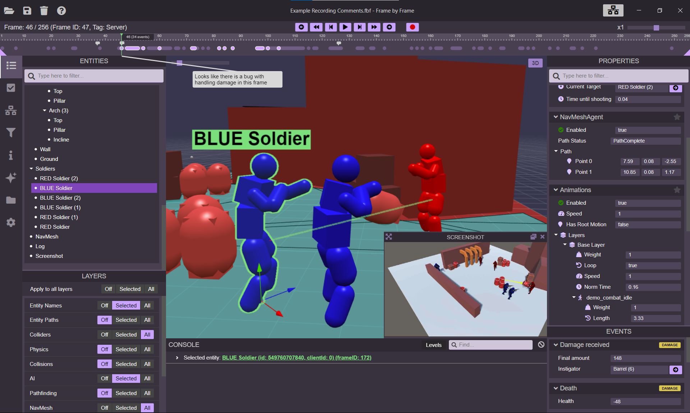

# Frame by Frame for Unity

Unity integration for [Frame by Frame](https://www.framebyframetool.com), a visual debugging and recording tool for 3D applications.




This repository contains the Unity Package Manager package:

```text
Packages/com.framebyframetool.integration
```

Package name:

```text
com.framebyframetool.integration
```

Version:

```text
1.0.0
```

Supported Frame by Frame viewer:

```text
Frame by Frame v1.1.0
```

## Requirements

- Unity 2022.3 or newer
- Frame by Frame v1.1.0 or newer
- `com.unity.nuget.newtonsoft-json`

The package manifest declares its Unity package dependencies.

## Installation

### Git URL

In Unity, open **Window > Package Manager**, click **+**, choose **Add package from git URL**, and enter:

```text
https://github.com/XDargu/FrameByFrame-UnityIntegration.git?path=/Packages/com.framebyframetool.integration#v1.0.0
```

### Embedded Package

For local development, keep the package embedded at:

```text
Packages/com.framebyframetool.integration
```

### Unity Asset Store

After Asset Store approval, install **Frame by Frame for Unity** from the Unity Asset Store and import the package into your project.

## Quick Start

1. Open **Window > Frame by Frame**.
2. Add recorder components such as `RecordPhysics`, `RecordAI`, `RecordAnimations`, or `RecordLog` to the GameObjects you want to inspect.
3. Open Frame by Frame and click the "connect" button.
3. Choose the recording options in Frame by Frame you want to enable.
4. Enter play mode and record.

You can open **Edit > Project Settings > Frame by Frame** and choose the recording options you want enabled by default.
Add your own custom recording to anything else you might want to record.

## How Recording Works

Frame by Frame records selected runtime data from Unity and streams it to the Frame by Frame viewer over a local websocket connection. The Unity side does not try to record the whole scene automatically. Instead, you decide which systems expose debug data and which objects are eligible.

The basic model is:

- **Entities** are Unity `GameObject` instances recorded into the current frame. Calling `RecordEntity`, `RecordProperties`, or `RecordEvent` records the GameObject transform, name, parent relationship, and any extra data you add.
- **Properties** are state values for the current frame. Use them for data such as health, velocity, current state, target, path status, sensor ranges, or rendered debug shapes.
- **Events** are timeline markers attached to an entity. Use them for things that happened at a point in time, such as damage received, ability cast, goal changed, collision entered, log error, or door opened.
- **Recording options** are user-controllable switches. They let a team enable or disable categories such as `Physics`, `Navigation`, `Combat`, or `AI` before Play Mode and while connected to Frame by Frame.
- **Resources** are named payloads, usually used when a property references external data such as an encoded screenshot texture.

For large games, a good pattern is to combine recording options with local filters. For example, enable the `Navigation` option globally, but only record agents near the player, agents selected by a debug tool, or agents owned by the current test scenario.

## Editor Window

Open **Window > Frame by Frame** to control the local websocket server.

The window shows:

- server status
- connected client count
- websocket port and protocol
- play mode connection behavior
- last connection error
- raw recording controls
- discovered recording options

Recording options are discovered before Play Mode from `FrameByFrameRecordingOption` attributes, so teams can choose what to record before starting the game.

## Project Settings

Open **Edit > Project Settings > Frame by Frame**.

Connection settings:

- **Auto Start In Editor** starts the websocket server when the Unity editor loads.
- **Keep Alive Across Play Mode** keeps the server alive through play mode transitions.
- **Enable In Builds** allows the runtime initializer to start the server in player builds.
- **Development Builds Only** prevents the server from starting in non-development builds.
- **WebSocket Port** defaults to `23001`.
- **WebSocket Protocol** defaults to `frameByframe`.

Recording settings:

- **Raw Recording Path** sets the default `.fbf` raw recording path.
- **Recording Options** stores the default enabled state for each discovered option.

When settings are saved, the editor also writes a runtime settings asset to:

```text
Assets/FrameByFrame/Resources/FrameByFrameRuntimeSettings.asset
```

That asset lets internal player builds load the same build flags, connection settings, and recording option defaults.

## Built-in Recording Options

The package ships these built-in option IDs:

- `Animations`
- `Colliders`
- `Collisions`
- `Log`
- `Navigation`
- `NavMesh`
- `Physics`
- `ShapeHelpers`

Demo samples may add more options, such as `AI`, `Stats`, `Weapons`, and `Explosions`.

## Built-in Recorder Components

- `RecordPhysics`: records collider shapes, collision contacts, and Rigidbody velocity.
- `RecordAI`: records `NavMeshAgent` path and path status.
- `RecordNavMesh`: records the calculated NavMesh triangulation.
- `RecordAnimations`: records Animator layers, clips, playback state, and parameters.
- `RecordLog`: records Unity log messages and error events.
- `RecordPlane`: records a helper plane.
- `RecordScreenshot`: records screen captures as textured helper planes.

Add these components only where you want data recorded. For larger projects, prefer adding them through scene-specific recorder scopes or your own filtering logic so the plugin records relevant objects only.

## Recording Options

Use `FrameByFrameRecordingOption` on recorder components to make options visible before Play Mode.

```csharp
using FbF;
using UnityEngine;

[FrameByFrameRecordingOption("Combat", "Records combat state and combat events.")]
public sealed class RecordCombatDebug : MonoBehaviour
{
	public int health = 100;

	private void Update()
	{
		if (!FbFManager.IsRecordingOptionEnabled("Combat"))
		{
			return;
		}

		PropertyGroup combat = FbFManager.RecordProperties(gameObject, "Combat");
		combat.AddProperty("Health", health, new Icon("heart"));
	}
}
```

Only `id` and `description` are required. The `id` is the stable value used by code, project settings, live option messages, and the Frame by Frame viewer. Treat it like a serialized key: choose it deliberately and avoid renaming it casually.

For options that are created dynamically, register them manually:

```csharp
FbFManager.RegisterRecordingOption("Streaming", "Records world streaming state.");
FbFManager.SetRecordingOption("Streaming", true);
```

Prefer the attribute for normal recorder components because the editor can discover those options before entering Play Mode.

## Runtime API

The runtime API lives in the `FbF` namespace. Most custom recorders only need four calls:

```csharp
FbFManager.IsRecordingOptionEnabled("Combat");
FbFManager.RecordProperties(gameObject, "Combat");
FbFManager.RecordEvent(gameObject, "Damage Received", "Combat");
FbFManager.RecordResource("debug/screenshot.jpg", "image/jpg", encodedImage);
```

### Check Whether to Record

Always gate custom recorders behind a recording option or another local filter.

```csharp
if (!FbFManager.IsRecordingOptionEnabled("Navigation"))
{
	return;
}
```

This keeps recording intentional. Frame by Frame is most useful when the capture contains the entities and data you care about, not every object in the scene.

### Record an Entity

```csharp
EntityData entity = FbFManager.RecordEntity(gameObject);
```

`RecordEntity` adds the `GameObject` to the current Frame by Frame frame. The integration records its name, transform position, up vector, forward vector, and parent relationship. You usually do not need to call this directly because `RecordProperties` and `RecordEvent` call it for you.

### Record Properties

```csharp
PropertyGroup group = FbFManager.RecordProperties(gameObject, "Combat");
group.AddProperty("Health", health);
group.AddProperty("Is Reloading", isReloading);
group.AddProperty("Aim Direction", transform.forward);
```

Properties describe the current state of an entity for the current frame. Use them for values you want to inspect while scrubbing or pausing a recording.

Supported simple property values include:

- `bool`
- `string`
- `int`
- `float`
- `Vector2`
- `Vector3`

You can also add comments, nested groups, entity references, and tables:

```csharp
PropertyGroup group = FbFManager.RecordProperties(gameObject, "AI");

group.AddComment("Agent is waiting for a path result.");
group.AddEntityRef("Target", targetGameObject);

PropertyGroup steering = group.AddGroup("Steering");
steering.AddProperty("Desired Velocity", desiredVelocity);
steering.AddProperty("Avoidance Weight", avoidanceWeight);

PropertyTable scores = group.AddTable("Utility Scores", "Consideration", "Score");
scores.AddRow("Cover", coverScore.ToString("0.00"));
scores.AddRow("Reload", reloadScore.ToString("0.00"));
```

Use `Icon` to make important properties easier to scan in the viewer:

```csharp
group.AddProperty("Health", health, new Icon("heart", "#ff4d4d"));
group.AddProperty("Ammo", ammo, new Icon("package"));
```

Use `PropertyFlags.Collapsed` for verbose or secondary data:

```csharp
group.AddProperty("Raw State Name", animatorStateName, null, PropertyFlags.Collapsed);
```

### Record Events

```csharp
PropertyGroup evt = FbFManager.RecordEvent(gameObject, "Damage Received", "Combat");
evt.AddProperty("Amount", amount);
evt.AddProperty("Damage Type", damageType);
evt.AddEntityRef("Instigator", instigator);
```

Events are one-time entries on the Frame by Frame timeline. The event name should describe what happened. The tag groups related events, such as `Combat`, `Collision`, `Log`, or `Navigation`.

The returned `PropertyGroup` works like any other property group. Add enough context for someone looking at the recording later to understand the event without reproducing the bug.

Common event examples:

- `Damage Received`
- `Ability Started`
- `Goal Changed`
- `Path Failed`
- `Door Opened`
- `OnCollisionEnter`
- `Log Error`

### Render Shapes

Properties are not limited to text and numbers. A `PropertyGroup` can also contain 3D debug shapes rendered by the Frame by Frame viewer.

```csharp
PropertyGroup debug = FbFManager.RecordProperties(gameObject, "Navigation");

debug.AddLine(
	"Velocity",
	transform.position,
	transform.position + velocity,
	Color.blue,
	"Navigation");

debug.AddPath(
	"Current Path",
	pathCorners,
	Color.cyan,
	"Navigation");

debug.AddSphere(
	"Detection Radius",
	transform.position,
	detectionRadius,
	new Color(1.0f, 0.8f, 0.1f, 0.2f),
	"AI");
```

Available shape helpers include:

- `AddSphere`
- `AddAABB`
- `AddOOBB`
- `AddCapsule`
- `AddPlane`
- `AddLine`
- `AddMesh`
- `AddPath`
- `AddTriangle`

The `layer` argument lets the viewer group or filter related shapes. Use stable layer names such as `Physics`, `Navigation`, `Combat`, `Cover`, or `Perception`.

### Record Resources

Use `RecordResource` when a property needs to reference external payload data, such as an encoded image.

```csharp
FbFManager.RecordResource("screenshots/game-view.jpg", "image/jpg", encodedImageJson);

PropertyGroup screenshot = FbFManager.RecordProperties(gameObject, "Screenshot");
screenshot.AddPlane(
	"Game View",
	transform.position,
	transform.forward,
	transform.up,
	16.0f,
	9.0f,
	Color.white,
	"screenshots/game-view.jpg",
	"ShapeHelpers");
```

`RecordScreenshot` uses this pattern to send screenshots and render them as textured helper planes.

### Record Nearby Objects Only

Recording options answer "is this channel enabled?" They do not decide which objects are worth recording. Keep that decision in your recorder.

```csharp
using FbF;
using UnityEngine;

[FrameByFrameRecordingOption("NearbyAgents", "Records agents near the player.")]
public sealed class RecordNearbyAgent : MonoBehaviour
{
	public Transform player;
	public float radius = 30.0f;

	private void Update()
	{
		if (!FbFManager.IsRecordingOptionEnabled("NearbyAgents") || player == null)
		{
			return;
		}

		float distance = Vector3.Distance(transform.position, player.position);
		if (distance > radius)
		{
			return;
		}

		PropertyGroup group = FbFManager.RecordProperties(gameObject, "Agent");
		group.AddProperty("Distance To Player", distance);
		group.AddLine("Direction To Player", transform.position, player.position, Color.yellow, "AI");
	}
}
```

This pattern scales well for production projects because each game team can define relevance using its own gameplay concepts.

## Internal Builds

Frame by Frame is intended for editor and internal/development builds, not public release builds.

By default, runtime startup is guarded by:

- `Config.enableInBuilds`
- `Config.developmentBuildsOnly`
- `Debug.isDebugBuild`

For development builds, save the Frame by Frame Project Settings so Unity generates the runtime settings asset under `Assets/FrameByFrame/Resources`.

## Documentation

Official package documentation lives under:

```text
Packages/com.framebyframetool.integration/Documentation~
```

Start with [Documentation~/README.md](Packages/com.framebyframetool.integration/Documentation~/README.md).

## License

Frame by Frame for Unity is distributed under the MIT License. See [LICENSE](LICENSE).
